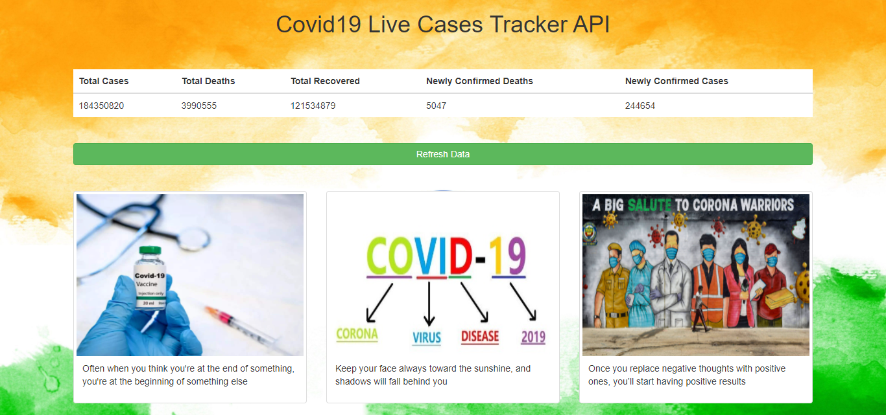

# Covid19-Live-Cases-API-JS

<b>Covid19 API that tells live Global total cases, total deaths, total recovered, newly confirmed deaths and newly confirmed cases</b>

 API
https://covid19api.com/

 
Bootstrap jquery

      

Bootstrap cdn

